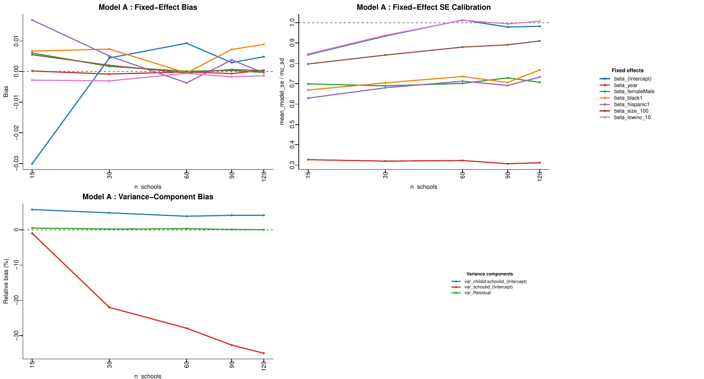
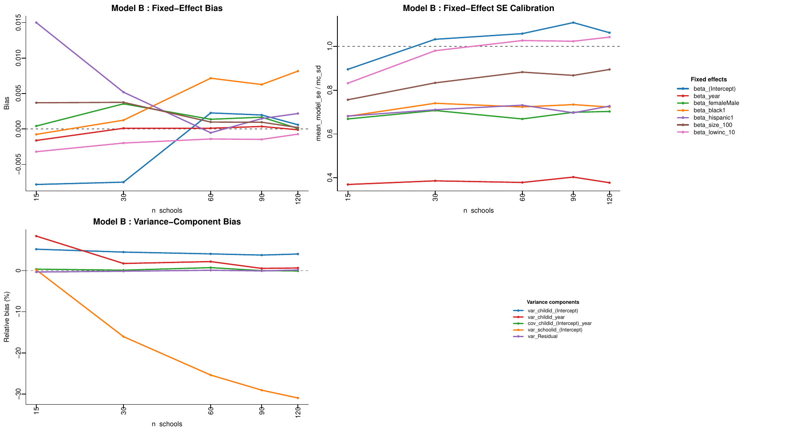
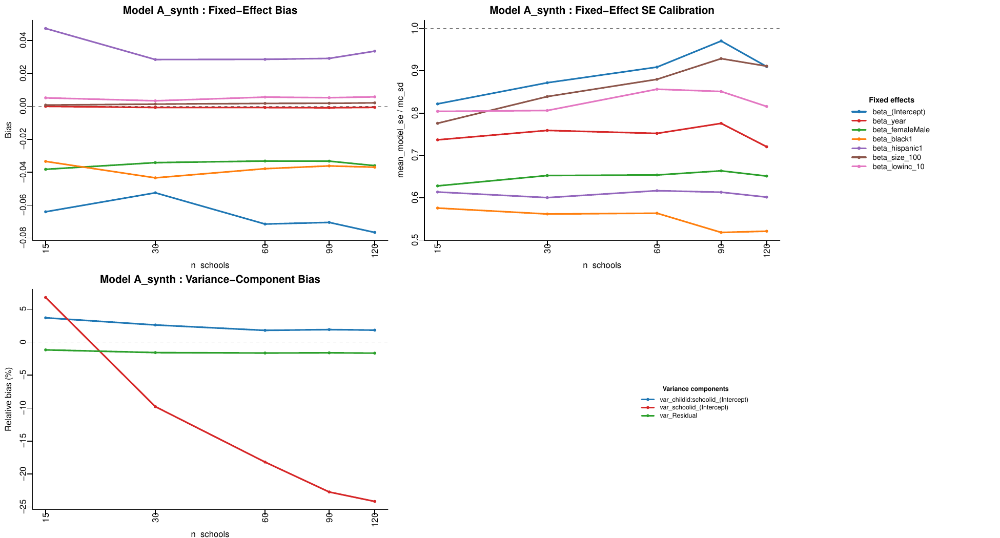

```{r setup, include=FALSE}
knitr::opts_chunk$set(echo = FALSE, warning = FALSE, message = FALSE)
library(knitr)

egsingle <- local({
  e <- new.env()
  utils::data("egsingle", package = "mlmRev", envir = e)
  e$egsingle
})

real_summary  <- readRDS("summary_table.rds")
synth_summary <- readRDS("../tests/synthetic_calibration_summary.rds")
```

# Purpose

This report documents Goal 5a of the RESI mixed-model extension project (see
`instructions/instructions.md` and `log/claudeLog.md` at the repository root):
a calibration check of the plasmode simulation machinery for `lme4::lmer`
before any RESI confidence-interval theory is layered on top. It collects, in
one place: the dataset used, the exact simulation settings, the full-scale
calibration results, and a follow-up diagnostic simulation that tests a
hypothesis about the source of a fixed-effect SE mis-calibration found in the
full-scale run.

# Dataset: `mlmRev::egsingle`

`egsingle` is a 3-level growth-curve dataset (measurement occasion nested in
child nested in school) used as the plasmode base because it is the only
dataset found (across `lme4`, `nlme`, `geepack`, `mlmRev`, `JM`, `joineR`,
`merTools`) with >=1000 independent subjects, a continuous repeated-measures
outcome, and a continuous time covariate suitable for a smooth term.

## Overall size

```{r dataset-size}
size_tab <- data.frame(
  Quantity = c("Schools", "Children", "Measurement occasions (rows)"),
  N        = c(length(unique(egsingle$schoolid)),
               length(unique(egsingle$childid)),
               nrow(egsingle))
)
kable(size_tab, caption = "Overall dataset size")
```

## Children per school

```{r children-per-school}
n_per_school <- table(egsingle$schoolid[!duplicated(egsingle$childid)])
cps <- as.numeric(n_per_school)
cps_tab <- data.frame(
  Min = min(cps), `1st Qu.` = quantile(cps, 0.25), Median = median(cps),
  Mean = round(mean(cps), 2), `3rd Qu.` = quantile(cps, 0.75),
  Max = max(cps), SD = round(sd(cps), 2), check.names = FALSE
)
rownames(cps_tab) <- NULL
kable(cps_tab, caption = "Distribution of children per school (60 schools)")
```

Every one of the 60 schools has at least 5 children, up to 89, with a mean of
28.7 and median of 24 children per school (SD 18.1) -- a right-skewed,
moderately variable cluster-size distribution, which is why the plasmode
resampling below draws each school's *own* number of children (not a fixed
number) when it is resampled.

## Variables

```{r variable-table}
var_tab <- data.frame(
  Variable   = c("schoolid", "childid", "year", "grade", "math", "retained",
                 "female", "black", "hispanic", "size", "lowinc", "mobility"),
  Level      = c("3 (school, n=60)", "2 (child, n=1721)",
                 "1 (occasion, n=7230 rows)", "1 (occasion)", "1 (occasion)",
                 "1 (occasion)", "2 (child)", "2 (child)", "2 (child)",
                 "3 (school)", "3 (school)", "3 (school)"),
  Type       = c("factor", "factor", "continuous", "continuous (0-4)",
                 "continuous", "binary factor", "binary factor",
                 "binary factor", "binary factor", "continuous",
                 "continuous", "continuous"),
  Description = c(
    "school identifier",
    "child identifier, nested in school",
    "time, centered (range -2.5 to 2.5, integer steps)",
    "grade level, collinear with year",
    "outcome: math achievement score",
    "held back a grade (mostly time-invariant)",
    "child sex", "child race indicator", "child ethnicity indicator",
    "school enrollment size", "% low income at school",
    "% student mobility at school"),
  stringsAsFactors = FALSE
)
kable(var_tab, caption = "egsingle variables and nesting structure")
```

# Simulation design

## Fixed-divisor covariate rescaling

`size` (school enrollment, range 113-1486, SD 312.6) is on a very different
scale from the other covariates and caused an `lme4` convergence warning when
used raw. Both `size` and `lowinc` are rescaled by a **fixed divisor** (not a
z-score), applied identically to every replicate, so coefficients stay
directly interpretable:

- `size_100 = size / 100` (school enrollment in hundreds of students)
- `lowinc_10 = lowinc / 10` (percent low-income in units of 10 percentage points)

Combined with `lmerControl(optimizer = "bobyqa", optCtrl = list(maxfun = 2e5))`,
both models below fit with 0 convergence warnings on the full data.

## Models A and B

Shared fixed effects:
`math ~ year + female + black + hispanic + size_100 + lowinc_10`

- **Model A** (random intercepts only):
  `+ (1 | schoolid/childid)`
- **Model B** (random slope for `year` at the child level):
  `+ (1 + year | childid) + (1 | schoolid)`

All models are fit with `REML = FALSE` (maximum likelihood), since the
full-data fit's fixed effects and variance components are used as the
"truth"/population target that each replicate is compared against (the same
convention `insurancePlasmodeSim()`/`simCalibrationSim()` use for `lm`/`glm`).

## Two-stage hierarchical plasmode resampling

Because the design is genuinely 3-level and nested (not crossed), each
replicate is resampled in two stages, implemented in
`RESI/R/simulations.R` (`.longSimBuildIndex()` / `.longSimResampleHierarchical()`):

1. Draw `n_schools` schools **with replacement** from the 60 real schools.
2. Within each drawn school, draw (with replacement) as many children as
   that *source* school originally had, keeping each child's full row set
   (all measurement occasions) intact.
3. Re-key `schoolid`/`childid` so repeated draws of the same school/child are
   treated as distinct clusters by `lmer`.

This is the standard "cases" cluster bootstrap for nested multilevel data.

## Settings used for the full-scale run

```{r settings-table}
settings_tab <- data.frame(
  Setting = c("nsim", "n_schools.vec", "model", "mc.cores.reps",
              "mc.cores.settings", "Estimation"),
  Value = c("1000", "c(15, 30, 60, 90, 120)", "both (A and B)", "24",
            "1 (sequential over the 10 model x n_schools cells)",
            "REML = FALSE, lmerControl(optimizer = \"bobyqa\", optCtrl = list(maxfun = 2e5))")
)
kable(settings_tab, caption = "longitudinalCalibrationSim() production settings (main.R)")
```

Random-effect (variance component) standard errors are **not** computed;
only fixed-effect model-based SEs are compared against the Monte Carlo SD of
each fixed effect across replicates. Variance-component point estimates are
still tracked for bias.

# Full-scale calibration results (real data)

Ran on 2026-09-05: 1000/1000 successful fits in every one of the 10
(model x `n_schools`) cells, 0 convergence failures.

## Fixed-effect bias and SE calibration

Bias (`truth - mc_mean`) shrinks toward 0 for every fixed effect in both
models as `n_schools` grows, as expected. SE calibration
(`mean_model_se / mc_sd`, target 1) shows a **two-tier pattern**:

```{r se-ratio-table}
fe <- real_summary[grepl("^beta_", real_summary$param), ]
wide <- reshape(fe[, c("model", "param", "n_schools", "se_ratio")],
                 idvar = c("model", "param"), timevar = "n_schools", direction = "wide")
wide <- wide[order(wide$model, wide$param), ]
kable(wide, digits = 3, row.names = FALSE,
      caption = "mean_model_se / mc_sd by fixed effect, model, and n_schools (target = 1)")
```

- **School-level covariates** (`size_100`, `lowinc_10`) and the intercept
  converge to ~1.0 by `n_schools = 60`.
- **Child-level, time-invariant covariates** (`female`, `black`, `hispanic`)
  plateau around **0.7** and never approach 1, regardless of `n_schools`.
- **The occasion-level covariate `year`** plateaus around **0.3-0.4**, in
  *both* Model A and Model B, even though Model B has a random slope for
  `year`.

```{r fig-model-a, fig.cap="Model A: fixed-effect bias, SE calibration, and variance-component bias vs. n_schools."}

```

```{r fig-model-b, fig.cap="Model B: fixed-effect bias, SE calibration, and variance-component bias vs. n_schools."}

```

## Variance components

```{r vc-bias-table}
vc <- real_summary[!grepl("^beta_", real_summary$param), ]
vc$rel_bias_pct <- 100 * vc$bias / vc$truth
widevc <- reshape(vc[, c("model", "param", "n_schools", "rel_bias_pct")],
                    idvar = c("model", "param"), timevar = "n_schools", direction = "wide")
widevc <- widevc[order(widevc$model, widevc$param), ]
kable(widevc, digits = 2, row.names = FALSE,
      caption = "Variance/covariance component relative bias (%) by n_schools")
```

`var_Residual`, the child-level variance/covariance, and (in Model B)
`var_childid_year` are all well calibrated (relative bias magnitude <=~5% at
`n_schools = 120`). **`var_schoolid_(Intercept)` (the between-school
variance) is the exception**: relative bias grows from about -1% at
`n_schools = 15, 30` out to **-28% to -35%** at `n_schools = 60, 90, 120` --
i.e. the Monte Carlo mean increasingly *overestimates* the full-data
between-school variance once `n_schools` approaches/exceeds the real pool of
60 schools.

# Slope-heterogeneity diagnostic (synthetic DGP)

## Motivation and method

**Hypothesis:** minor real variation in schools' *own* coefficients for
covariates other than the intercept (which Model A cannot model, since it
only has random intercepts) is being absorbed into the fixed-effect sampling
variability, causing the SE mis-calibration above.

**Test:** a synthetic version of `egsingle` was built
(`tests/test_egsingle_synthetic_calibration.R`) in which `math` is simulated
from Model A's own full-data fitted parameters via
`simulate.merMod(use.u = FALSE)`. By construction, every school/child shares
the *exact same* fixed slope for every covariate -- only random intercepts
vary (drawn fresh from the estimated variance components), plus fresh iid
residual noise. The same two-stage resampling + refit pipeline (`nsim =
1000`, same `n_schools.vec`, Model A only) was then rerun on this synthetic
data.

## Results

```{r synth-comparison-table}
real_a <- real_summary[real_summary$model == "A" & grepl("^beta_", real_summary$param),
                        c("param", "n_schools", "se_ratio")]
names(real_a)[3] <- "se_ratio_real"
synth_fe <- synth_summary[grepl("^beta_", synth_summary$param),
                           c("param", "n_schools", "se_ratio")]
names(synth_fe)[3] <- "se_ratio_synth"
cmp <- merge(real_a, synth_fe, by = c("param", "n_schools"))
cmp <- cmp[order(cmp$param, cmp$n_schools), ]
kable(cmp, digits = 3, row.names = FALSE,
      caption = "se_ratio: real data vs. synthetic (zero true slope heterogeneity), Model A")
```

```{r fig-synth, fig.cap="Model A refit on the synthetic (zero true slope heterogeneity) dataset: fixed-effect bias, SE calibration, and variance-component bias vs. n_schools."}

```

## Interpretation

- **`beta_year`: hypothesis largely confirmed.** `se_ratio` jumped from a
  flat ~0.31-0.33 (real data) to ~0.72-0.78 (synthetic, zero true slope
  heterogeneity). Model A has no random slope for `year`, so real
  cross-school/child heterogeneity in the true year-slope was leaking into
  the `year` fixed effect's sampling variability; removing that
  heterogeneity recovered most (not all) of the calibration.
- **`beta_female`/`black`/`hispanic1`: not explained.** `se_ratio` stayed
  similarly poor, or slightly worse, under the synthetic (zero true slope
  heterogeneity) DGP. Since these are child-level, time-invariant
  covariates, this points away from slope heterogeneity and toward the
  resampling design itself -- most plausibly the two-stage
  **with-replacement** child resampling, which re-keys duplicate real
  children as independent clusters within a replicate.
- **`var_schoolid_(Intercept)` growing bias for `n_schools >= 60`: not
  explained.** Still grows to about -18% to -24% (vs. -28% to -35% real
  data) even with zero true slope heterogeneity -- likely the same
  with-replacement-oversampling-beyond-the-60-school-pool mechanism, not
  slope heterogeneity.
- `beta_(Intercept)`/`size_100`/`lowinc_10` (school-level): similar or
  slightly worse under the synthetic DGP; inconclusive on this diagnostic
  alone.

# Open questions / next steps

- Test the with-replacement-resampling-artifact hypothesis directly (e.g.
  rerun with children sampled *without* replacement, or cap `n_schools` at
  60) to see whether it explains the remaining child-level-covariate and
  `var_schoolid` mis-calibration.
- These findings are directly relevant to the open Goal 2 design question
  about the effective sample size `n` for L-RESI: a single "number of
  schools" (or "number of children") scaling will not correctly calibrate
  SEs for *all* fixed effects simultaneously in this 3-level design; the
  correct unit plausibly differs by which level a covariate varies at.
- Decide whether `n_schools` values above 60 (oversampling beyond the real
  school pool) should be dropped from future sweeps or are informative
  as-is.
